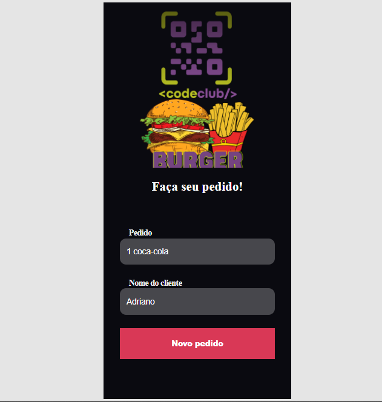
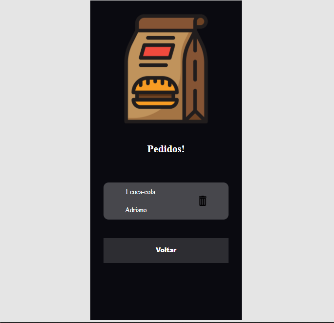

# LAnchonete CodeClub

### Adicionando e excluindo pedidos!

> Essa aplicação é uma pagina de uma lanchonete onde voce pode fazer pedidos!
 
 

Essa aplicaçao tem duas telas, onde na primeira voce adiciona seu pedido e seu nome, e na segunda tela voce pode excluir ou voltar e fazer um novo pedido!

  

   

#### tecnologias que foram usadas:

- React
- React hooks(useState, useRef, useEffect)
- Styled-components
- Axios
- react-router-dom
- Yarn
